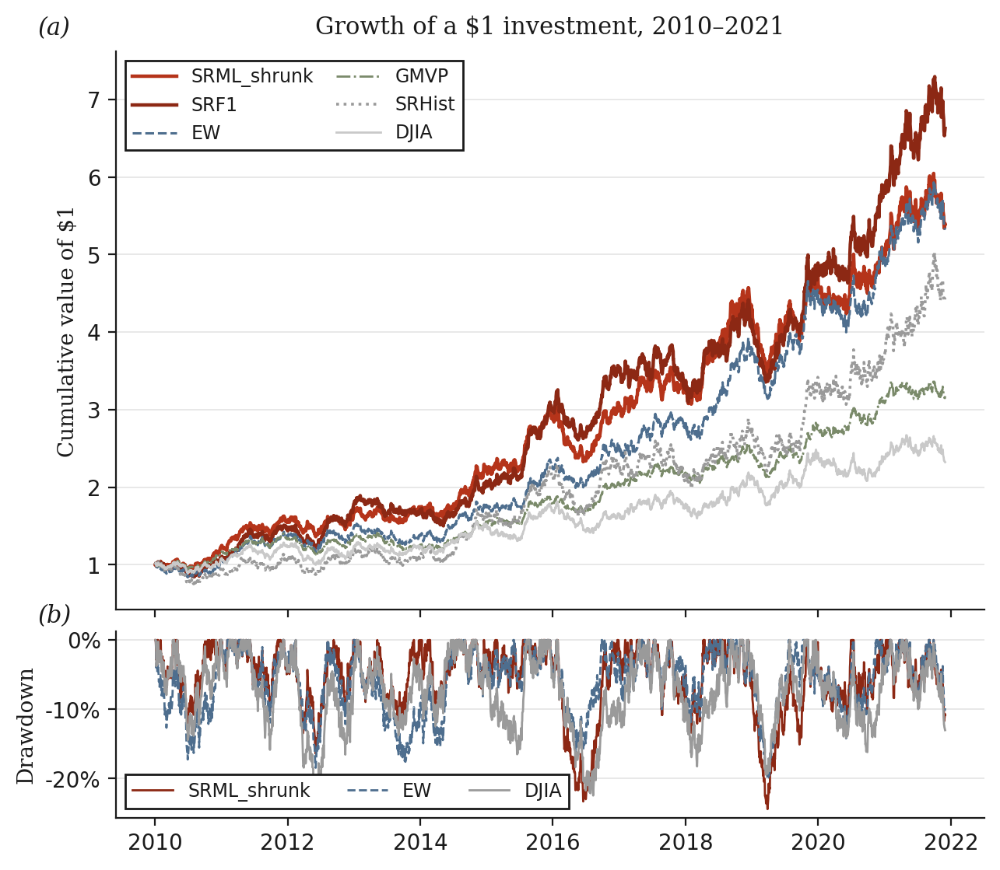
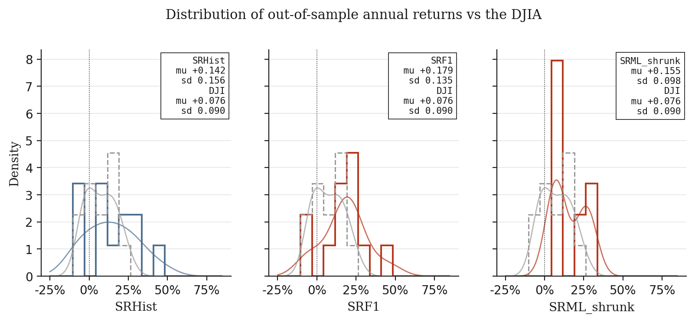
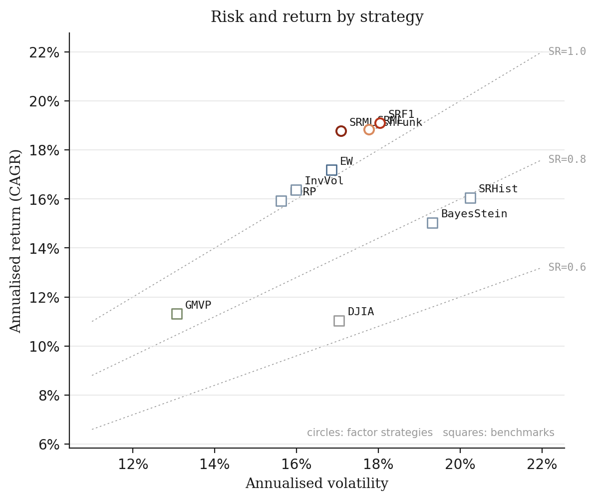
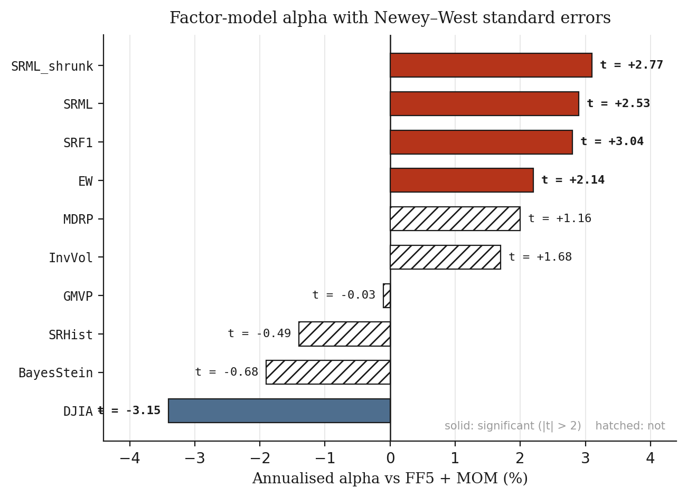
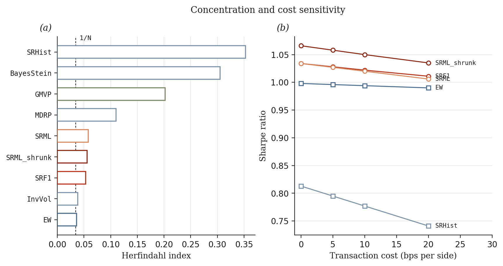
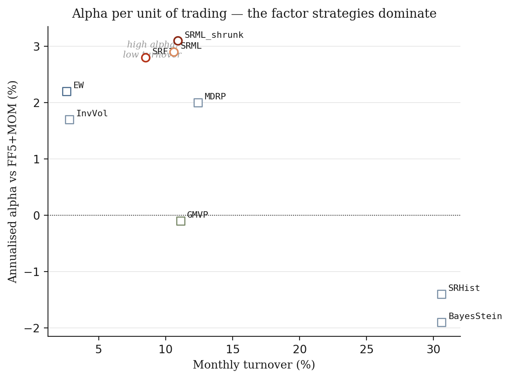
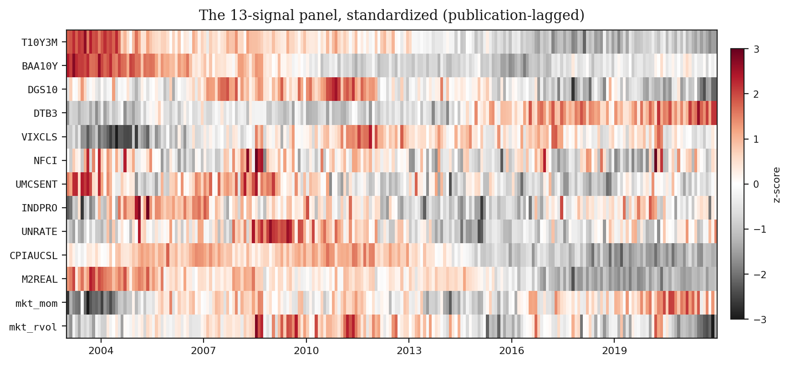
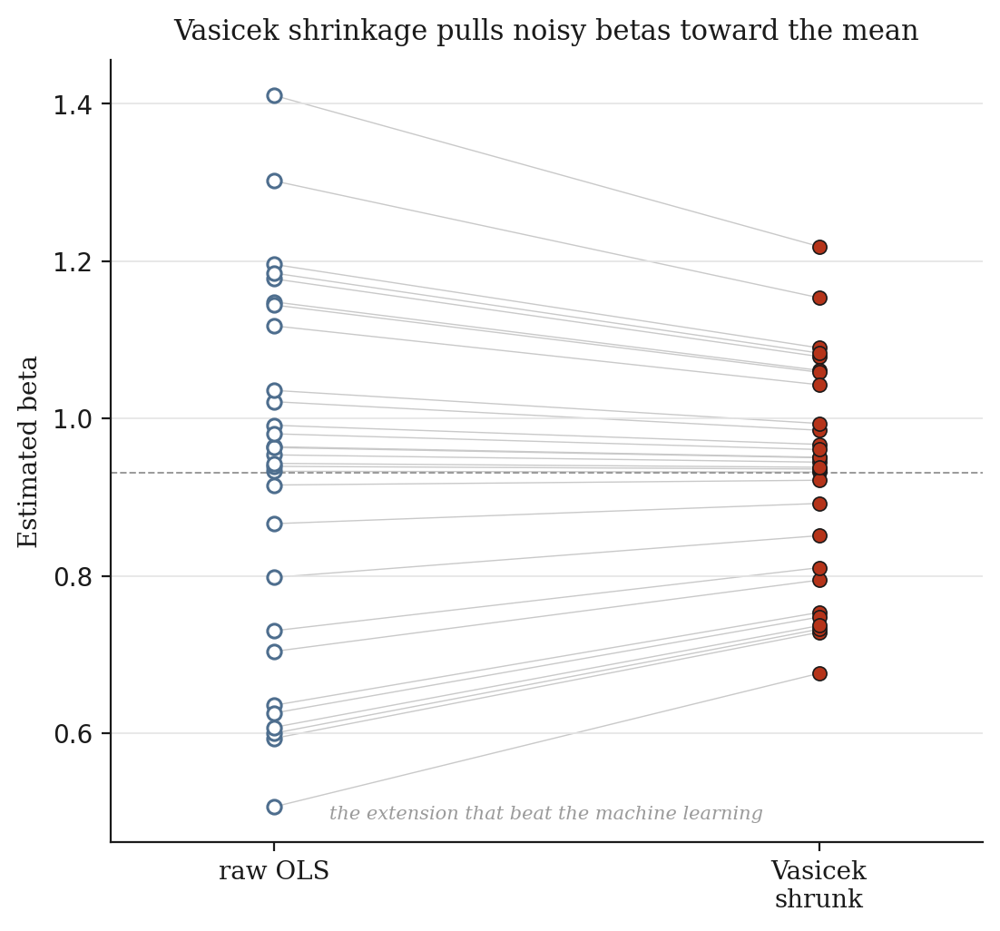
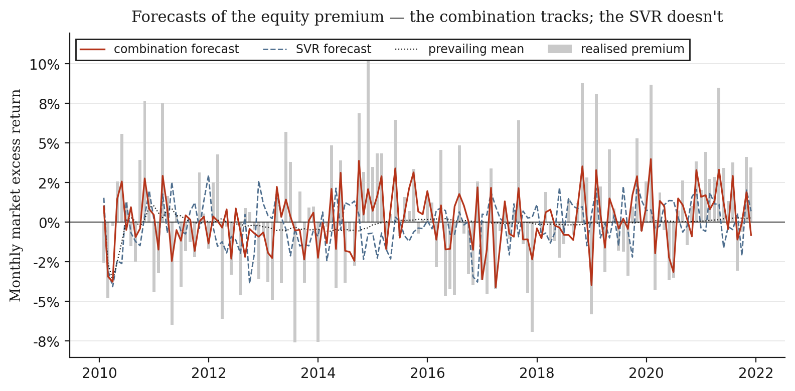

result.

# fbpo , Factor-Based Portfolio Optimization

Independent reproduction and extension of **Auh, J.K. & Cho, W. (2023),
"Factor-based portfolio optimization," *Economics Letters* 228, 111137**
([doi](https://doi.org/10.1016/j.econlet.2023.111137)).

Research and educational purposes only. **Not investment advice.**

---

## What this is

The paper's thesis: estimating a portfolio's expected returns from raw
historical means injects idiosyncratic noise that drives mean–variance
optimizers into corner solutions. A parsimonious single-factor structure
(μᵢ = r_f + βᵢ · premium) estimates *one* market premium and projects it
through betas replacing N noisy parameters with one forecast plus N
precisely-estimated loadings. A machine-learning forecast (SVR) of the premium then adds forward-looking information.

This repository reproduces that result from public data on a 2009–2021 sample of
DJIA constituents and extends it with formal inference the original omits:
paired Sharpe bootstrap tests, deflated Sharpe ratios, Clark–West nested
forecast tests, and FF5+MOM factor attribution.

## Headline result

The factor-structure claim **reproduces cleanly**: it cuts portfolio
concentration to one-fifth that of naive estimation (matching the paper), earns
~3% annualised alpha against six factors (t ≈ 3) where naive estimation earns
none, and makes SRHist the worst out-of-sample performer despite the most
machinery whic the paper's key finding.

The ML extension **diverges, for a documented reason**: with the 13 FRED-
automatable signals used here (versus the paper's 22, which include licensed
options and sentiment data), the SVR forecast adds nothing beyond the historical
mean. The factor structure is the robust contribution; the ML uplift depends on
the richer signal set. See [`RESULTS.md`](RESULTS.md) for the full comparison.

An unexpected finding: **Vasicek beta shrinkage (1973) contributes more to
Sharpe than the SVR does.**

## Reproduce it

```bash
uv sync --all-extras
uv run fbpo config-show --config configs/base.yaml   # prints hash 43c9ce2e
uv run fbpo fetch-data  --config configs/base.yaml   # ~2 min, hits network
uv run fbpo backtest    --config configs/base.yaml   # ~8 min, 144 rebalances
uv run pytest -q                                     # 130+ tests
```

Every result artifact lands in `reports/`, named by the config hash so it is
self-identifying. Bit-reproducible on a fixed BLAS thread count; see
`reports/env_fingerprint.json`.

## Results at a glance

An independent reproduction of Auh &amp; Cho (2023), *Factor-based portfolio
optimization* (*Economics Letters* 228, 111137), on 29 Dow-Jones constituents
over 2010&ndash;2021. Full numbers are in [`RESULTS.md`](RESULTS.md); the figures
below tell the story. Colour convention throughout: **brick red = factor
strategies** (the paper's method), **slate = benchmarks**, grey = the index.

---

### 1 &middot; Cumulative performance



Growth of a \$1 investment across all ten strategies, with a drawdown panel
beneath. The factor strategies (`SRF1`, `SRML`, `SRML_shrunk`) compound past the
naive mean&ndash;variance portfolio (`SRHist`), the equal-weight benchmark, and
the Dow itself. This is the reproduction of the paper's headline Figure 1(b):
the factor structure turns roughly \$1 into \$7 over twelve years while the naive
approach lags with markedly larger drawdowns.

### 2 &middot; Out-of-sample return distributions



A direct reproduction of the paper's Figure 1(a): step histograms with kernel
density overlays and inline &mu;/&sigma; boxes, each strategy benchmarked against
the DJI. Moving left to right &mdash; `SRHist` to `SRF1` to `SRML_shrunk` &mdash;
the distribution tightens and shifts right: lower variance, higher mean. The
factor structure does not just raise return but it compresses the spread of
outcomes.

### 3 &middot; Risk and return



Every strategy placed by annualised volatility (x) against CAGR (y), with dashed
iso-Sharpe lines for reference. Circles mark the factor strategies, squares the
benchmarks. The factor strategies sit up and to the left of `SRHist` &mdash;
higher return for less risk &mdash; landing on a higher Sharpe contour than the
naive estimator, which is stranded at high volatility.

### 4 &middot; Factor-model alpha



The decisive test. Each strategy's daily excess return is regressed on the
Fama&ndash;French five factors plus momentum, with Newey&ndash;West (HAC)
standard errors. Solid bars are statistically significant (|t| &gt; 2); hatched
bars are not. The factor strategies earn **~3% annualised alpha at t &asymp; 3**
&mdash; return the six factors cannot explain &mdash; while the naive strategies
(`SRHist`, `BayesStein`, `GMVP`) show alpha indistinguishable from zero. This is
the mechanism behind the paper's result made explicit.

### 5 &middot; Concentration and cost



Left: the Herfindahl index of portfolio weights, with the 1/N line marked. The
factor strategies are roughly **one-fifth as concentrated** as the naive
approach reproducing the paper's signature 0.066-vs-0.338 finding almost
exactly (this implementation: 0.053 vs 0.353). Right: Sharpe ratio as transaction costs rise from 0 to 20 bps per side. The factor edge survives realistic costs; the naive approach, which trades four times as much, bleeds far faster.

### 6 &middot; Alpha per unit of trading



Annualised alpha against monthly turnover. The factor strategies occupy the
top-left of high alpha, low turnover  while the naive estimators sit
bottom-right, trading 30% of the book each month to earn no alpha at all. A
portfolio that must churn to stand still is exactly what estimation error
produces.

### 7 &middot; The 13-signal panel



The thirteen market predictors used to forecast the equity premium, standardised and shown over time. Every signal is publication-lagged so that no value at month *t* uses information unavailable at  the look-ahead guard the whole pipeline is built around. The vertical dark bands are the 2008 and 2020 stress periods lighting up the volatility and credit signals at once.

### 8 &middot; Vasicek beta shrinkage



Raw OLS betas (left) pulled toward the cross-sectional mean by Vasicek
empirical-Bayes shrinkage (right); each line tracks one asset. Noisily-estimated betas are pulled hardest, precisely-estimated ones barely move. This 1973 shrinkage rule is the single addition in the whole project that contributes more to the Sharpe ratio than the machine-learning forecast does which unexpected

### 9 &middot; The premium forecast



Forecasts of the monthly market excess return against what actually realised. The
Rapach&ndash;Strauss&ndash;Zhou combination forecast (brick) tracks the premium
and significantly beats the prevailing mean (Clark&ndash;West p = 0.033); the SVR
(slate dashed) does not (p = 0.063). With the 13 public signals used here, the
machine learning overfits &mdash; Goyal &amp; Welch (2008) reproducing &mdash;
which is why the ML portfolio extension adds nothing the historical mean did not.

---

## Interactive simulations

Two browser-based simulations that let you turn the paper's knobs directly. Both run entirely client-side with no dependencies as you just fdownload and open in any browser, or enable GitHub Pages (Settings &rarr; Pages &rarr; Deploy from branch
&rarr; `main` / `/docs`) to make them live

### I &middot; Estimation error and the corner solution

**[&rarr; Launch simulation](docs/sims/sim1_estimation_error.html)**

Drag the estimation-noise slider and watch the maximum-Sharpe optimizer abandon
diversification. As noise rises, the weights collapse into a corner, the
Herfindahl index climbs, and the Sharpe the optimizer *believes* it has achieved
diverges from the Sharpe those weights *actually* realise on the true means. The
gap between believed and realised is estimation error, priced &mdash; the paper's
entire thesis made tactile.

### II &middot; Factor structure versus direct estimation

**[&rarr; Launch simulation](docs/sims/sim2_factor_vs_direct.html)**

Run direct estimation and the factor structure on the same synthetic universe,
out of sample, as the universe grows. Direct estimation must fit *N* noisy means
from a short sample and its Sharpe decays as *N* rises; the factor approach fits
one premium and *N* persistent betas, and holds flat. The parameter count is the
whole story, and this is the paper's central argument simulated live.

Layout

| Module             | Role                                                     |
| ------------------ | -------------------------------------------------------- |
| `config.py`      | Typed, validated, hashed configuration (pydantic)        |
| `data.py`        | Prices, factors, calendar, the DOW eligibility rule      |
| `signals.py`     | 13-signal causal panel with publication lags             |
| `estimation.py`  | Rolling betas, Vasicek / Blume shrinkage                 |
| `covariance.py`  | Five covariance estimators + conditioning diagnostics    |
| `optimize.py`    | Convex max-Sharpe (Schaible), GMVP, MDRP, robust variant |
| `forecast.py`    | SVR walk-forward, RSZ combination, ε-tube guard         |
| `benchmarks.py`  | Expected-return estimators, 10-strategy roster           |
| `backtest.py`    | Walk-forward engine (weight drift, turnover, costs)      |
| `stats.py`       | Paired Sharpe bootstrap, DSR, Clark–West                |
| `attribution.py` | FF5 + MOM regression, Newey–West errors                 |

## Extensions beyond the paper

Vasicek/Blume beta shrinkage · Bayes–Stein means · Ledoit–Wolf / OAS / EWMA /
single-index / Yang–Zhang covariance · robust (ellipsoidal) max-Sharpe · RSZ
combination forecast · paired stationary-bootstrap Sharpe tests · deflated
Sharpe · Clark–West · FF5+MOM attribution · transaction-cost sweep · full test
suite and determinism controls.

## Deviations

WBA excluded (delisted 2025-08, no free adjusted history → 29-asset universe);
13 FRED signals instead of 22 (licensed data unavailable); full-sample Sharpe
instead of the paper's rolling-mean estimator. All detailed in
[`RESULTS.md`](RESULTS.md) §8 and `docs/deviations.md`.

## Citation

> Auh, J.K., & Cho, W. (2023). Factor-based portfolio optimization.
> *Economics Letters*, 228, 111137. https://doi.org/10.1016/j.econlet.2023.111137
